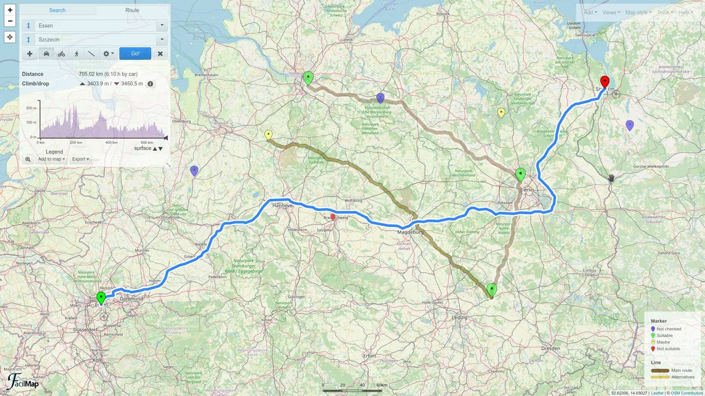

<!--
Este archivo README esta generado automaticamente<https://github.com/YunoHost/apps/tree/master/tools/readme_generator>
No se debe editar a mano.
-->

# Facilmap para Yunohost

[](https://ci-apps.yunohost.org/ci/apps/facilmap/)  

[](https://install-app.yunohost.org/?app=facilmap)

*[Leer este README en otros idiomas.](./ALL_README.md)*

> *Este paquete le permite instalarFacilmap rapidamente y simplement en un servidor YunoHost.*
> *Si no tiene YunoHost, visita [the guide](https://yunohost.org/install) para aprender como instalarla.*

## Descripción general

Collaborative maps and routing with a straightforward interface

**Versión actual:** 4.1.2~ynh1

**Demo:** <https://facilmap.org/>

## Capturas



## Documentaciones y recursos

- Sitio web oficial: <https://facilmap.org/>
- Documentación usuario oficial: <https://docs.facilmap.org/users/>
- Documentación administrador oficial: <https://docs.facilmap.org/developers/>
- Repositorio del código fuente oficial de la aplicación : <https://github.com/FacilMap/facilmap>
- Catálogo YunoHost: <https://apps.yunohost.org/app/facilmap>
- Reportar un error: <https://github.com/YunoHost-Apps/facilmap_ynh/issues>

## Información para desarrolladores

Por favor enviar sus correcciones a la [`branch testing`](https://github.com/YunoHost-Apps/facilmap_ynh/tree/testing

Para probar la rama `testing`, sigue asÍ:

```bash
sudo yunohost app install https://github.com/YunoHost-Apps/facilmap_ynh/tree/testing --debug
o
sudo yunohost app upgrade facilmap -u https://github.com/YunoHost-Apps/facilmap_ynh/tree/testing --debug
```

**Mas informaciones sobre el empaquetado de aplicaciones:** <https://yunohost.org/packaging_apps>
